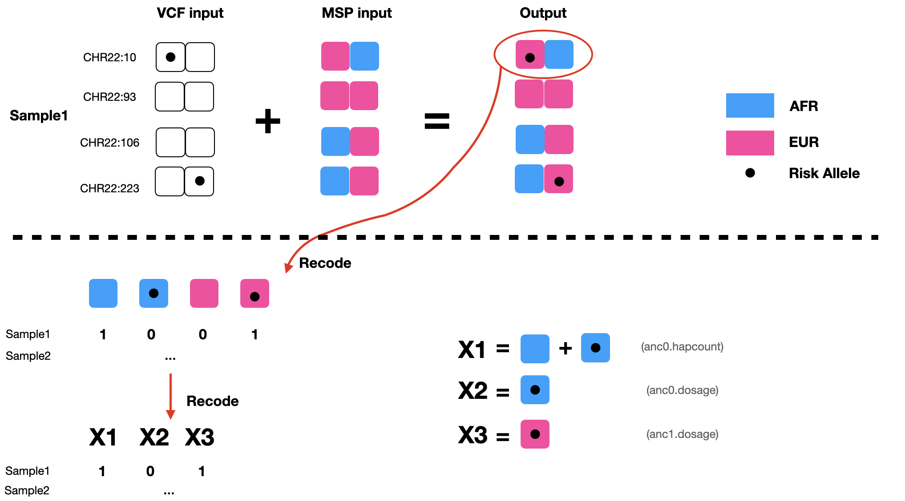

Compared to the standard GWAS model, Tractor takes local ancestry into account and therefore may help improve discovery power when there are (LD, MAF, or effect size) differences across ancestries, as well as better localizing top hits, and providing more accurate effect size estimates. In the [previous step](Rfmix.md), we demonstrated how to perform local ancestry inference using Rfmix. Now, we will process the RFmix output files to generate more interpretable intermediate files which will be used in statistical modeling.


&nbsp;  
&nbsp;  

## Prerequisites

#### Download Tractor Scripts

Tractor scripts can be easily installed with:
```
git clone https://github.com/Atkinson-Lab/Tractor.git
```

&nbsp;  
&nbsp;  

#### Check files in `ADMIX_COHORT` directory

We have demonstrated how to perform phasing and local ancestry inference, respectively, on the first page of this tutorial. To recap, after running phasing with Shapeit2, we should have 
```
ASW.phased.haps
ASW.phased.sample
ASW.phased.vcf
ASW.phased.vcf.gz
```
The `ASW.phased.vcf.gz` is converted from standard shapeit2 output, and will be used as an argument for `ExtractTracts.py`.

&nbsp;  

We have also performed local ancestry inference with Rfmix, and the following files have been generated
```
ASW.deconvoluted.fb.tsv	
ASW.deconvoluted.msp.tsv
ASW.deconvoluted.rfmix.Q
ASW.deconvoluted.sis.tsv
```

The `ASW.deconvoluted.msp.tsv` file, which contains the most likely ancestral assignment for all variants in each individual in the cohort, will be later used as an argument for `ExtractTracts.py`.

&nbsp;  
&nbsp;  


## Extract Tracts

We provide a script that can simultaneously extract risk allele information and local ancestry information. Simply type the following command in terminal:
```
python Tractor/ExtractTracts.py \
      --msp ADMIX_COHORT/ASW.deconvoluted \
      --vcf ADMIX_COHORT/ASW.phased \
      --zipped \
      --num-ancs 2
```
Note that we used the --zipped flag because the files we are using in this tutorial at zipped. If your data has not been zipped, omit this flag.

6 files will be generated:
```
ASW.phased.anc0.dosage.txt
ASW.phased.anc0.hapcount.txt
ASW.phased.anc0.vcf
ASW.phased.anc1.dosage.txt
ASW.phased.anc1.hapcount.txt
ASW.phased.anc1.vcf
```

&nbsp;  

#### What happened under the hood?

Let's take a peek at our input files `ASW.phased.vcf.gz` and `ASW.deconvoluted.msp.tsv`.

The phased vcf file contains haplotype information for each individual in the cohort. Reference alleles are represented with a 0, alternate alleles (often assumed to be the risk allele) as a 1. Here you can see the first 4 variants in chromosome 22 for SAMPLE1:
```
CHROM POS REF ALT SAMPLE1   ...
22    10  A   T   1|0       ...
22    93  G   A   0|0       ...
22    106 G   A   0|0       ...
22    223 G   A   0|1       ...

...
```

The msp file contains local ancestry information for each person, for each of their two chromosome strands. Notice its coordinates are in a different format from the vcf file -- the msp file uses a window to specify LA information. For example, the first row of the following msp file is telling us this: for SAMPLE1, strand0 from position 1 to position 52 is inherited from `EUR` ancestry (ancestry 1 in our input files) and strand 1 from position1-position52 is inherited from an `AFR` background (anc0 in our input files). Generally, RFmix orders ancestries alphabetically, so the first will be anc0, the second anc1, etc.

```
AFR=0       EUR=1
CHROM SPOS  EPOS SAMPLE1.0 SAMPLE1.1   ...
22    1     52  1         0       ...
22    52    101 1         1       ...
22    101   190 0         1       ...
22    190   283 0         1       ...

...
```


&nbsp;  

By checking both files simultaneously, we can figure out the local ancestry (LA) background of each of the alleles in our dataset, as the upper portion of the following diagram shows. To represent both LA and risk allele information, we need to recode each variant into 4 columns, with each column represents a unique combination of LA and risk allele (`AFR-nonRisk`, `AFR-Risk`, `EUR-nonRisk`, `EUR-Risk`). In the diagram below, at the first variant, SAMPLE1 has one copy of `AFR-nonRisk`, and one copy of `EUR-Risk`, and therefore will be encoded to **[1,0,0,1]**. 

&nbsp;  

To further compress the information, `ExtractTracts.py` did an additional step -- talling the total number of copies of `AFR` local ancestry for each variant for each person. This can be thought of as adding `AFR-nonRisk` and `AFR-Risk`. 

&nbsp;  





&nbsp; 

Running ExtractTracts.py on our toy dataset will generate 6 files, and 3 of them will be used in the next step for statistical modeling in the Tractor GWAS. You can read about the other files on the Tractor Wiki for this script [here](https://github.com/Atkinson-Lab/Tractor/wiki/Step-2:-Extracting-tracts-and-ancestral-dosages).
```
ASW.phased.anc0.hapcount.txt        (used as X1)
ASW.phased.anc0.dosage.txt          (used as X2)
ASW.phased.anc1.dosage.txt          (used as X3)
```


## [Recover Tracts](Recover.md)      &nbsp;&nbsp;&nbsp;&nbsp;&nbsp;&nbsp;&nbsp;&nbsp;&nbsp;&nbsp;&nbsp;&nbsp;&nbsp;&nbsp;&nbsp;&nbsp;&nbsp;&nbsp;&nbsp;&nbsp;&nbsp;&nbsp;&nbsp;&nbsp;&nbsp;&nbsp;&nbsp;&nbsp;&nbsp;&nbsp;&nbsp;&nbsp;&nbsp;&nbsp;&nbsp;&nbsp;&nbsp;&nbsp;&nbsp;&nbsp;&nbsp;&nbsp;&nbsp;&nbsp;&nbsp;&nbsp;&nbsp;&nbsp;&nbsp;&nbsp;&nbsp;&nbsp;&nbsp;&nbsp;&nbsp;&nbsp;&nbsp;&nbsp;&nbsp;&nbsp;     [Main Page](README.md)

## [Option1: Hail Tractor](Hail.md) &nbsp;&nbsp;&nbsp;&nbsp;&nbsp;&nbsp;&nbsp;&nbsp;&nbsp;&nbsp;&nbsp;&nbsp;&nbsp;&nbsp;&nbsp;&nbsp;&nbsp;&nbsp;&nbsp;&nbsp;&nbsp;&nbsp;&nbsp;&nbsp;&nbsp;&nbsp;&nbsp;&nbsp;&nbsp;&nbsp;&nbsp;&nbsp;&nbsp;&nbsp;&nbsp;&nbsp;&nbsp;&nbsp;&nbsp;&nbsp;&nbsp;&nbsp;&nbsp;&nbsp;&nbsp;&nbsp;&nbsp;&nbsp;&nbsp;&nbsp;&nbsp;      [Option2: Local Tractor](Local.md)  
