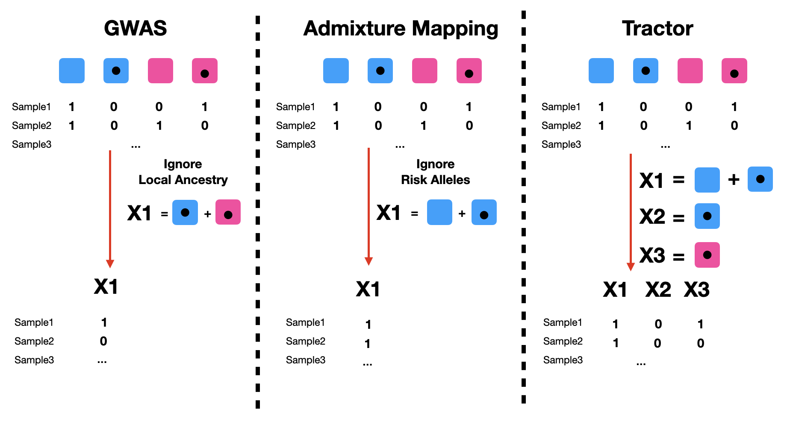

&nbsp;  
&nbsp;  

## Intuition

Tractor implicitly assumes that the risk alleles that reside in different local ancestry background present different effect size, and therefore performing LAI may provide better biological insights, allows a less-biased estimates, and potentially increase power. Here in this section, we will first compare Tractor with standard GWAS analysis, and admixture mapping, and we will then go over `RunTractor.py` to run Tractor method locally or in a HPC setting.

&nbsp;  
&nbsp;  

## Compare GWAS, Admixture mapping and Tractor 

In standard GWAS, we assume that local ancestry background doesn’t play a role in determining the phenotypes, and therefore is ignorable. 

