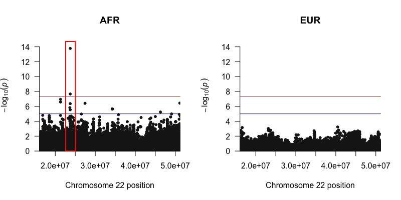

## Intuition

Tractor implicitly assumes that the risk alleles that reside in different local ancestry backgrounds may have different marginal effect sizes (e.g. due to LD, MAF, phenotyping differences, or true effect size differences), and therefore performing LAI may provide better biological insights, allows for less-biased effect size estimates, and potentially increased gene discovery power. In this section, we will first compare Tractor with standard GWAS analysis and admixture mapping, and we will then go over the `RunTractor.py` script to run the Tractor method locally or in a HPC setting.

## Compare GWAS, Admixture mapping and Tractor 

In standard GWAS, we use individuals' genotype information but don't take into account local ancestry information. In the following diagram, if we sum up `AFR-Risk` and `EUR-Risk`, and perform a linear/logistic regression, we will recover a standard GWAS input.

In admixture mapping, we assume local ancestries affect the phenotype but don't take into account the allelic information. In this setting, we look at the number of copies of a specific ancestry background (`AFR` in this example). Summing up `AFR-Risk` and `AFR-noRisk` and performing a linear/logistic regression, we will recover admixture mapping.

Tractor takes both local ancestry and risk alleles into account and can be viewed as a combined method of GWAS and admixture mapping. In the Tractor model, we have 3 explanatory variables: X1 represents the number of `AFR` local ancestry haplotypes at a variant (identical to the X term used in admixture mapping); X2 represents the number of risk alleles on an AFR background - `AFR-Risk`, X3 represents the number of risk alleles on an EUR background `EUR-Risk`. In this way, we can get ancestry-specific summary statistics as output. In other words, we will observe if risk alleles on an `AFR` background may affect the phenotype differently compared with risk alleles on `EUR`. Such a case of differing marginal effect sizes at GWAS SNPs occur due to different tagging of causal variants depending on the ancestry; LD blocks, polymorphic loci, and allele frequencies differ across ancestries due to different populations' demographic histories.


## Run Tractor locally

We have developed an R script `run_tractor.R` that allows users to run Tractor GWAS in a local machine/high performance computer. Please make sure the following libraries are installed within R
* optparse
* data.table
* R.utils
* dplyr
* doParallel

Alternatively, you can create a conda environment as described on [Tractor README](https://github.com/Atkinson-Lab/Tractor?tab=readme-ov-file#setup-conda-environment). This should automatically take care of all the necessary dependencies.

For the phenotype file, we expect users to prepare a tab-delimited file which contains sample IDs, phenotype column, and covariate columns. A header column is required, and column names for the aforementioned requirements can be input in the `run_tractor.R` code. Please refer to its Usage or [Documentation here](https://github.com/Atkinson-Lab/Tractor?tab=readme-ov-file#step-2-running-tractor).

This is one example of how a phenotype file can be defined:
```
IID	y	COV	...
SAMPLE1	1	0.32933076689022	...
SAMPLE2	1	1.42015135263198	...
SAMPLE3	0	1.57285800531035	...
SAMPLE4	0	-0.303899298288934	...
SAMPLE5	1	0.491130537379353	...
...	...	...	...
```

* Please make sure all columns (expect the first column) of `Phe.txt` were encoded as numerical type. We currently do not automatically convert string to numbers.
* Please include header in `Phe.txt`


To perform linear regression on a (simulated) continuous phenotype in our admixed cohort, simply type the following command in your terminal:

```
run_tractor.R \
--hapdose admixed_cohort/ASW.phased \
--phenofile phenotype/Phe.txt \
--covarcollist none \
--method linear \
--output ASW_sumstats.txt

# Optional Arguments (not needed for here)
## --sampleidcol
## --phenocol
## --chunksize (no. of rows to read at once, Default: 10000)
## --nthreads  (no. of threads to use)
```

This generates our summary statistic output, which has the estimated ancestry-specific p value and effect sizes for each locus for each ancestry. More specifically, you shall see the following columns in the summary statistics:
```
CHR             Chromosome 
POS             Position 
ID              SNP ID
REF             Reference allele
ALT             Alternate allele
N               Total sample size

AF_anc0         Allele frequency for anc0; sum(dosage)/sum(local ancestry)
LAprop_anc0     Local ancestry proportion for anc0; sum(local ancestry)/2 * sample size
beta_anc0       Effect size for alternate alleles inherited from anc0
se_anc0         Standard error for effect size (beta_anc0)
pval_anc0       p-value for alternate alleles inherited from anc0 (NOT -log10(pvalues))
tval_anc0       t-value for anc0

AF_anc1         Allele frequency for anc1; sum(dosage)/sum(local ancestry)
LAprop_anc1     Local ancestry proportion for anc1; sum(local ancestry)/2 * sample size
beta_anc1       Effect size for alternate alleles inherited from anc1
se_anc1         Standard error for effect size (beta_anc1)
pval_anc1       p-value for alternate alleles inherited from anc1 (NOT -log10(pvalues))
tval_anc1       t-value for anc1

LApval_anc0     p-value for the local ancestry term (X1 term in Tractor)
LAeff_anc0      Effect size for the local ancestry term (X1 term in Tractor)
```

&nbsp;  
&nbsp;  
To visualize Tractor GWAS results, we may use the R package [qqman](https://cran.r-project.org/web/packages/qqman/vignettes/qqman.html) to draw a manhattan plot of our sumstats, and indeed we see a top hit in the AFR with some LD friends. Note in particular that we have a hit in only the AFR ancestry background in this example, no signal is observed in the EUR plot. We recommend plotting QQ plots with the lambda GC values shown in addition to your Manhattan plots to ensure your GWAS was well controlled.

```
library(qqman)
sumstats = read.csv("SumStats.tsv", sep = "\t")

# Assuming anc0 is AFR and anc1 is EUR. Please check LAI output to identify ancestry classifications.
par(mfrow=c(1,2))
manhattan(sumstats[!is.na(sumstats$Gpval_anc0),], chr="CHROM", bp="POS", snp="ID", p="pval_anc0",
          xlim = c(min(sumstats$POS), max(sumstats$POS)), ylim = c(0,15), main = "AFR")
manhattan(sumstats[!is.na(sumstats$Gpval_anc1),], chr="CHROM", bp="POS", snp="ID", p="pval_anc1",
          xlim = c(min(sumstats$POS), max(sumstats$POS)), ylim = c(0,15), main = "EUR")
```




## [Main Page](README.md)
