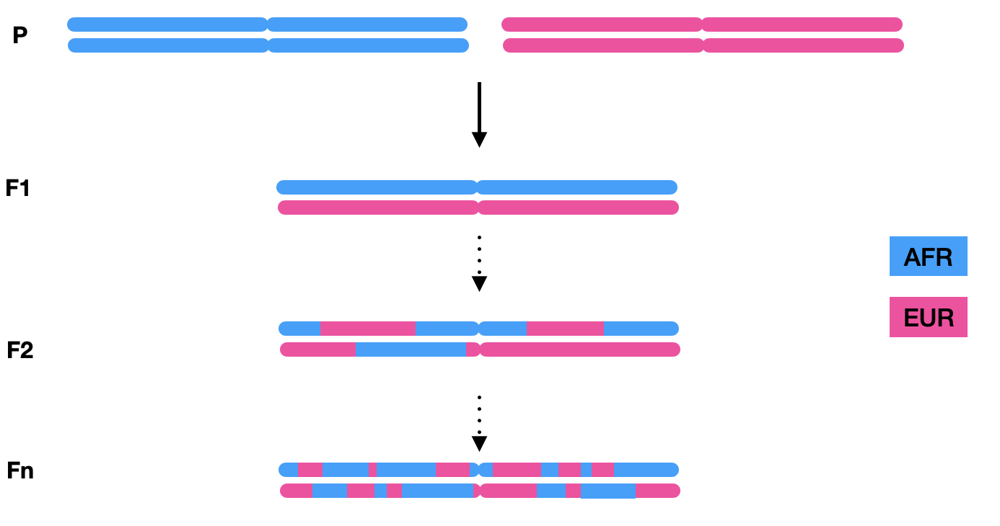

&nbsp;  
&nbsp;  

# Step0. Phasing and Local Ancestry inference

&nbsp;  
&nbsp; 

### Data
We have provided an example dataset that you may follow along with this tutorial. Please download from here, and unzip them.

The dataset we are going to use here is 61 African Americans (only chromosome 22) from the Thousand Genome project – two-way admixtures of EUR and AFR population. Besides, we also provided the haplotype reference panel that is downloaded from  [Shapeit](https://mathgen.stats.ox.ac.uk/impute/data_download_1000G_phase1_integrated_SHAPEIT2_16-06-14.html), which will be used for phasing. We also provide phased reference vcf files (EUR and AFR ancestry, respectively) for local ancestry inference. Here is a complete list of the files:

```
data
│
└───ADMIX_COHORT
│       |ASW.unphased.vcf.gz
│   
└───AFR_EUR_REF
|       |YRI_TSI.phased.vcf
|       |YRI_TSI.tsv
|       |chr22.genetic.map.modified.txt
|
└───HAP_REF    
        |chr22.hap.gz
        |chr22.legend.gz
        |ALL.sample
        |chr22.genetic.map.txt
```


&nbsp;  
&nbsp;  


## Software 
Shapeit2: v2.r837
Rfmix2
Tractor (requires the following packages: numpy, statsmodel, pandas)


&nbsp;  
&nbsp;  


## Statistical Phasing 

&nbsp;  
&nbsp;  
 
 Genotype and sequencing data is often written in vcf format. Due to the diploid nature of the human genome, the sequencing/genotyping technology can only capture the genotype information but not the haplotype. We therefore don't know which allele is on which strand of the chromosome. The purpose of statistical phasing is to recover the configuration of alleles across a chromosome, as the diagram shows:


Notice that each entry is separated with slash (e.g. `0/1`), and that means the vcf file is unphased. By performing phasing, we will figure out the most likely configuration of allele positions. After performing the following steps, we should get a phased vcf file, with slash substituted by a vertical bar (e.g. `1|0`).


&nbsp;  
&nbsp;  
&nbsp;  
 

Although many software has been developed, here we will use [shapeit](https://mathgen.stats.ox.ac.uk/genetics_software/shapeit/shapeit.html#output) to perform phasing based on reference haploid panel. According to the manual [here](https://mathgen.stats.ox.ac.uk/genetics_software/shapeit/shapeit.html#reference), the phasing procedure consists of the following 4 steps:

&nbsp;  

#### A. Downloading 1000 genome phase 1 reference panel (already attached in HAP_REF folder)
 
&nbsp;  
&nbsp;  

#### B. Aligning common variants between query vcf and reference panel

The goal of this step is to find the common variants of the haplotype reference panel and our admixed population. Running the following script, Shapeit will typically produce two files `alignments.strand`, `alignments.strand.exclude`, which tell us the variants we should exclude in the downstream analysis. However, the dataset I am using here doesn’t have any variant conflicts, and therefore we can ignore this potential issue for now.

```       
shapeit -check \
        --input-vcf ADMIX_COHORT/ASW.unphased.vcf.gz \
        --input-map HAP_REF/chr22.genetic.map.txt \
        --input-ref HAP_REF/chr22.hap.gz HAP_REF/chr22.legend.gz HAP_REF/ALL.sample \
        --output-log alignments
```
    

The program will print some information and also throw some error message. You may pay attention to some of these messages:

```       
* 61 samples included
* 217153 SNPs included


# if reference panel sites are different from query vcf file, shapeit2 might print:
* #Missing sites in reference panel = 123456
* #Misaligned sites between panels = 123456
* #Multiple alignments between panels = 123456
```

&nbsp;  
&nbsp;  

#### C. Phasing (this is the most computational expensive step). 

We will perform the actual phasing in this step. Notice we should pass argument `--exclude-snp alignments.snp.strand.exclude` to the program if you encounter errors with your own dataset, so that conflict variants can be excluded before phasing.

After running this command, you should find two file (`ASW.phased.haps` & `ASW.phased.sample`) have been created in the `ADMIX_COHORT` directory.


```       
shapeit  --input-vcf ADMIX_COHORT/ASW.unphased.vcf.gz \
      --input-map HAP_REF/chr22.genetic.map.txt \
      --input-ref HAP_REF/chr22.hap.gz HAP_REF/chr22.legend.gz HAP_REF/ALL.sample \
      -O ADMIX_COHORT/ASW.phased 
      
      
      # add this if shapeit throw error message:   --exclude-snp alignments.snp.strand.exclude
```    

&nbsp;  
&nbsp;       
      
 
#### D. Converting the shapeit outcome to vcf format.

Shapeit provides convenient function to convert from `haps` file format to `vcf` format. Notice in the new vcf file we just created, slashes are substituted by vertical bar to seperate genotype. Additionally, we can zip the vcf file to save disc space.

```       
shapeit -convert \
        --input-haps ADMIX_COHORT/ASW.phased\
        --output-vcf ADMIX_COHORT/ASW.phased.vcf
        

bgzip -c ADMIX_COHORT/ASW.phased.vcf > ADMIX_COHORT/ASW.phased.vcf.gz
```   

--- 

(Note: your homogeneous population reference panel might not be phased in real practice; if so, you may consider to run Shapeit pipeline on reference panel as well)

&nbsp;  
&nbsp;  
&nbsp;  
&nbsp;  


## Local Ancestry Inference

&nbsp;  
&nbsp;  

Once we achieved a homogeneous population phased reference vcf file and a phased admixture vcf file, we can start to perform local ancestry inference. Admixed population tend to have a mosaic chromosome, meaning their chromosomes are inherited from multiple ancestries. The average length of local ancestry tracts is inversely proportional to the # of generations.

For example, the 1st generation of African American population inherited one intact copy of chromosomes from EUR ancestry, and one intact copy of chromosomes from AFR ancestry. However, for newer generations of admixed populations, the chromosome will break down into smaller pieces due to crossover events in meiosis.



&nbsp;  
&nbsp;  

The goal of running local ancestry inference is to "paint" the chromosomes based on ancestry origin. In the downstream analysis, we will use local ancestry information to help us better understand the genotype-phenotype association.


&nbsp;  
&nbsp;  

Here we use Rfmix to perform local ancestry inference, given its high accuracy in admixed population. RFmix takes the following argument and will produce 4 files `ASW.deconvoluted.fb.tsv`, `ASW.deconvoluted.msp.tsv`, `ASW.deconvoluted.rfmix.Q`, `ASW.deconvoluted.sis.tsv`, most of which will be used in the downstream analysis. Among those files, it's worth double check `ASW.deconvoluted.rfmix.Q` to make sure the global ancestry proportion is expected. 


```
rfmix -f ADMIX_COHORT/ASW.phased.vcf.gz \
        -r AFR_EUR_REF/YRI_GBR.phased.vcf.gz \
        -m AFR_EUR_REF/YRI_GBR.tsv \
        -g AFR_EUR_REF/chr22.genetic.map.modified.txt \
        -o ADMIX_COHORT/ASW.deconvoluted \
        --chromosome=22
```


That's the end of this step. We will demonstrate how to iteratively improve phasing and local ancestry inference in the [next post](Recover.md)


&nbsp;  
&nbsp; 

## [Next Page](Recover.md)


