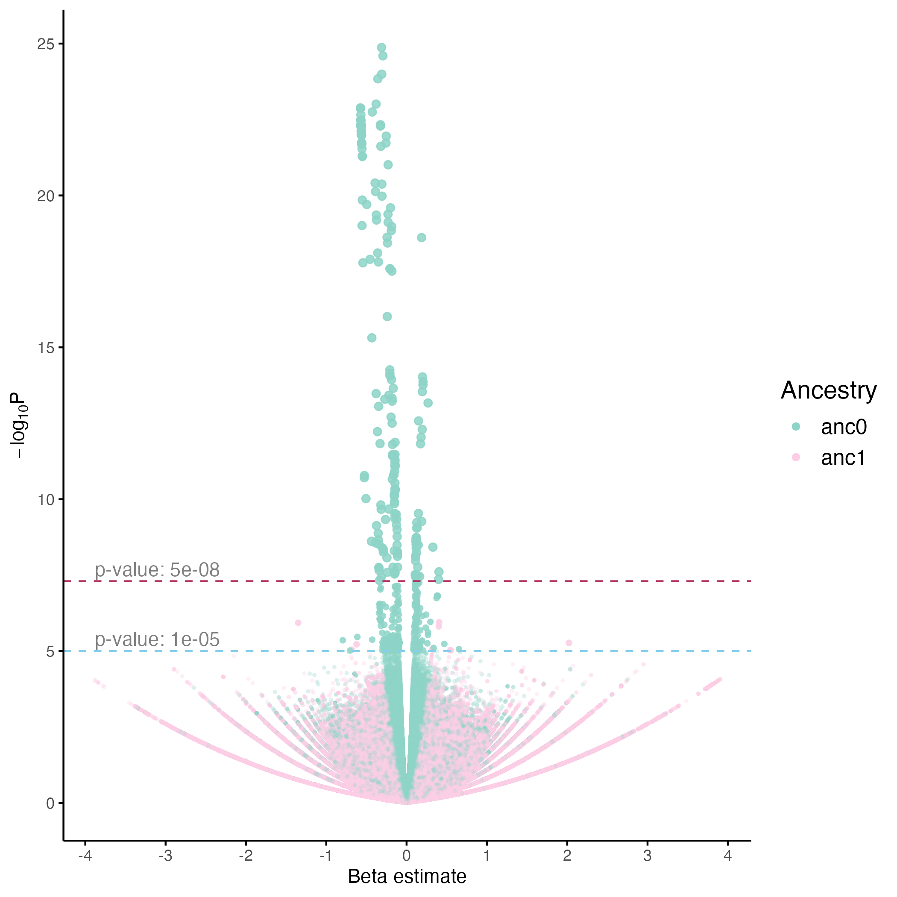

# Visualization of Tractor Summary Statistics

**Tractor** is a local-ancestry-aware GWAS tool that produces summary statistics in a single file, including p-values and effect sizes for all haplotypic ancestral terms in your cohort.

Detailed descriptions of the output columns are available in [Tractor GWAS local implementation](Local.md).

In this guide, we demonstrate how to generate **Manhattan and Q-Q plots** using **ggplot2** for summary statistics generated using Tractor. We use **ggplot2** for Manhattan plots as it offers superior customization options. An example code snippet is provided below to help you get started.

> **Note:** P-values can vary substantially between phenotypes. Some datasets may have closely clustered values, while others may contain extreme outliers. You may need to adjust the Y-axis or code to suit your specific dataset, but it's a great place to get started.

### Customizing the Y-axis

You can modify the y-axis using `scale_y_continuous()`, for example by setting `breaks` and `labels`:

```r
# Example:
scale_y_continuous(
    # breaks = scale_y_breaks, 
    # labels = scale_y_labels
)
```

**Applying Transformations on Y-axis**

To handle outliers and improve readability, you can apply a transformation to the y-axis (e.g., log-scale):

```r
scale_y_continuous(
    # transform = log10,                # Transform y-axis to log scale, or loglog scale if required.
)
```
* **Reference:** [ggplot2 scale_continuous documentation](https://ggplot2.tidyverse.org/reference/scale_continuous.html)

-------

## Generating Manhattan and QQ Plots

The following code demonstrates how to create a Manhattan and Q-Q plots from Tractor summary statistics. The code will generate plots for all ancestral terms within the summary statistics.

```r
# Load required packages
library(data.table)
library(dplyr)
library(ggplot2)
library(CMplot)

# Replace below
setwd("/.../.../.../")
sumstats_file <- "/path/to/xxxxxx_sumstats.txt.gz"


# Identify p-value columns
df_header <- fread(sumstats_file, nrows = 0)

pvalue_cols <- grep("^pval_", names(df_header), value = TRUE)
anc_list    <- sub("^pval_", "", pvalue_cols)
selected_cols <- c("CHR", "POS", "ID", pvalue_cols)

# Read summary statistics file, and set constants
df_sumstats <- fread(
  sumstats_file,
  select = selected_cols
)

chr_col       <- "CHR"
pos_col       <- "POS"
id_col        <- "ID"

threshold     <- 5e-8
suggestive_threshold <- 1e-5
x_label       <- "Genomic position"
y_label       <- expression(paste(-log[10], "P"))
colors        <- c("skyblue", "lightpink")
ylim_cap      <- 5                                          # padding for y-axis

ouptut_prefix <- "tmp_tractor_phenotype"

# Function for Lambda GC calculation (assumes no 0's in p-values)
compute_lambda_from_pval <- function(pvals) {
  pvals <- na.omit(as.numeric(pvals))                       # Extract p-values and remove NAs
  # pvals[pvals == 0] <- min(pvals[pvals > 0], na.rm = TRUE)  # replace zeros (carried out outside this function)
  chisq_vals <- qchisq(1 - pvals, df = 1)                   # Convert p-values to chi-squared statistics
  lambda <- median(chisq_vals) / qchisq(0.5, df = 1)        # Calculate lambda GC
  return(lambda)
}


# Plot Manhattan + Q-Q plots for all ancestry-specific p-values
for (anc in anc_list) {
  
  pval_col <- paste0("pval_", anc)
  subset_cols <- c(chr_col, pos_col, id_col, pval_col)
  
  # Subset relevant columns
  df <- df_sumstats %>% select(all_of(subset_cols))
  
  # Drop NA values (primarily filter for any rows with p-values as NA)
  initial_row_count <- nrow(df)
  columns_to_check <- c(chr_col, pos_col, pval_col)
  
  for (col in columns_to_check) {
    na_count <- sum(is.na(df[[col]]))
    if (na_count > 0) {
      df <- df %>% filter(!is.na(!!sym(col)))
      cat(paste0("Rows dropped due to NA values in ", col, ": ", na_count, "\n"))
    }
  }
  
  final_row_count <- nrow(df)
  cat(paste0("Total rows dropped: ", initial_row_count - final_row_count, "\n"))
  
  # Replace p-value zeros with minimum non-zero value
  if (any(df[[pval_col]] == 0)) {
    # min_nonzero <- min(df[[pval_col]][df[[pval_col]] > 0], na.rm = TRUE)
    num_zero <- sum(df[[pval_col]] == 0, na.rm = TRUE)
    # df[[pval_col]][df[[pval_col]] == 0] <- min_nonzero
    df[[pval_col]][df[[pval_col]] == 0] <- .Machine$double.eps
    cat(paste0("Replaced ", num_zero, " zero p-values with .Machine$double.eps (",
               .Machine$double.eps, ") in ancestry ", anc, "\n"))
  }
  
  # # Uncomment below to replace p-values near 1. (Replaces all p-values>0.98 to 0.98)
  # if (any(df[[pval_col]] > 0.98)) {
  #   # max_nonone <- max(df[[pval_col]][df[[pval_col]] < 1], na.rm = TRUE)
  #   num_one <- sum(df[[pval_col]] > 0.98, na.rm = TRUE)
  #   df[[pval_col]][df[[pval_col]] > 0.98] <- 0.98
  #   # df[[pval_col]][df[[pval_col]] == 1] <- max_nonone
  #   cat(paste0("Replaced ", num_one, " p-values > 0.98 to ",
  #              0.98, " in ancestry ", anc, "\n"))
  # }
  
  # QQ Plot: Compute Lambda GC
  lambda_gc <- compute_lambda_from_pval(df[[pval_col]])
  cat(paste0("Lambda GC for ", anc, ": ", round(lambda_gc, 4), "\n"))
  
  # Manhattan Plot: Calculate cumulative positions per chromosome (Used for X-axis label centering)
  df_cum <- df %>%
    arrange(!!sym(chr_col), !!sym(pos_col)) %>%
    group_by(!!sym(chr_col)) %>%
    summarise(max_bp = max(!!sym(pos_col))) %>%
    mutate(bp_add = lag(cumsum(as.numeric(max_bp)), default = 0)) %>%
    select(!!sym(chr_col), bp_add)
  
  df <- df %>%
    inner_join(df_cum, by = chr_col) %>%
    mutate(cum_pos = !!sym(pos_col) + bp_add)
  
  # Manhattan Plot: Create axis set for chromosome centering
  axis_set <- df %>%
    group_by(!!sym(chr_col)) %>%
    summarize(center = mean(cum_pos))
  
  # Manhattan Plot: Calculate y-axis limits
  ylim <- df %>%
    filter(!!sym(pval_col) == min(!!sym(pval_col), na.rm = TRUE)) %>%
    mutate(ylim = abs(floor(log10(!!sym(pval_col)))) + ylim_cap) %>%
    pull(ylim)
  
  # Manhattan Plot: Maximum cumulative position for x-axis limits
  max_bp_cum <- max(df$cum_pos, na.rm = TRUE)
  
  # Plot Manhattan plot
  manhattan_plt <- df %>%
    ggplot(aes(x = cum_pos, y = -log10(!!sym(pval_col)))) +
    geom_point(aes(color = factor(!!sym(chr_col) %% 2)), size = 0.25) +
    scale_color_manual(values = colors) +
    scale_x_continuous(
      label = axis_set[[chr_col]],
      breaks = axis_set$center,
      limits = c(0, max_bp_cum),
      expand = expansion(0, 0)
    ) +
    scale_y_continuous(
      expand = expansion(0, 0),
      # trans = <add_transformation_function / replace "y = -log10(!!sym(pval_col))">,    # To transform y-axis, e.g. to be in log scale.
      # breaks = scale_y_breaks, labels = scale_y_labels,       # Manually offer exact breaks and labels for y-axis
      limits = c(0, ylim)
    ) +
    geom_hline(yintercept = -log10(threshold), color = 'gray30', linetype = 'solid') +
    geom_hline(yintercept = -log10(suggestive_threshold), color = "gray40", linetype = 'dashed') +
    annotate(
      "text", x = max_bp_cum, y = -log10(threshold) + 0.4,
      label = paste("p-value:", format(threshold, scientific = TRUE)),
      hjust = 1, color = "gray50"
    ) +
    annotate(
      "text", x = max_bp_cum, y = -log10(suggestive_threshold) + 0.4,
      label = paste("p-value:", format(suggestive_threshold, scientific = TRUE)),
      hjust = 1, color = "gray50"
    ) +
    labs(x = x_label, y = y_label) +
    theme_minimal() +
    theme(
      panel.grid = element_blank(),
      legend.position = "none",
      axis.line = element_line(),
      axis.ticks = element_line(),
      axis.text.x = element_text(size = 14),
      axis.text.y = element_text(size = 14)
    )
  
  ggsave(
    filename = paste0(ouptut_prefix, "_", anc, ".png"),
    plot = manhattan_plt,
    width = 15, height = 6, dpi = 900, bg = "transparent"
  )
  
  # QQ plot using CMplot
  output_filename <- paste0(ouptut_prefix, "_qq_", anc)
  # CMplot expects input dataframe in the format of genomic marker names, chromosome,
  # position, and p-values in rest of the columns
  df <- df %>% select(!!sym(id_col), !!sym(chr_col), !!sym(pos_col), !!sym(pval_col))
  CMplot(df, type="q",
         col = c("#6A3D58", "#CBC3E3"),
         plot.type = c("q"), LOG10 = TRUE,
         cex = c(0.5, 0.7, 0.5), amplify = FALSE,
         signal.cex = 0.72, signal.pch = NULL, chr.den.col = NULL,
         threshold = c(suggestive_threshold, threshold),
         threshold.lty = c(1, 2), threshold.lwd = c(1, 1),
         threshold.col = c("grey","black"),
         verbose = TRUE,
         width = 6, height = 6,
         main = paste("QQ Plot - Ancestry:", anc),
         main.cex = 1,
         file = "png",
         dpi = 300,
         file.output = TRUE,
         file.name = output_filename)
}

```

### Example plots:

**Example Manhattan plot:**


**Example QQ plot:**


------------

## Generating Volcano Plot to study effect sizes

To better explore and identify potential candidate variants, we provide example code to generate a Volcano plot illustrating the relationship between statistical significance (p-values) and effect sizes (β coefficients). By visualizing variants across these dimensions, researchers can more easily pinpoint those that are statistically significant and may indicate variants with potentially meaningful biological effects.

```r
# Load necessary packages
library(data.table)
library(dplyr)
library(tidyr)
library(ggplot2)
library(RColorBrewer)

# Replace below
setwd("/.../.../.../")
sumstats_file <- "/path/to/xxxxxx_sumstats.txt.gz"

# Set paths/required variables
threshold <- 5e-8
suggestive_threshold <- 1e-5
x_label <- "Beta estimate"
y_label <- expression(paste(-log[10], "P"))
output_file <- "tractor_effectsize_volcanoplot.png"

# Identify key columns
df_header <- fread(sumstats_file, nrows = 0)

pvalue_cols <- grep("^pval_", names(df_header), value = TRUE)
beta_cols   <- grep("^beta_", names(df_header), value = TRUE)
anc_list    <- sub("^pval_", "", pvalue_cols)
selected_cols <- c("CHR", "POS", "ID", pvalue_cols, beta_cols)

# Read summary statistics for specific columns
df_sumstats <- fread(sumstats_file, select = selected_cols)

# Reshape to long format (auto-detects pval/beta pairs)
df_long <- df_sumstats %>%
  pivot_longer(
    cols = all_of(c(pvalue_cols, beta_cols)),
    names_to = c(".value", "Ancestry"),
    names_pattern = "(pval|beta)_(.*)"
  )

# Add new columns: threshold, transparency and size of points in the plot.
df_long <- df_long %>%
              filter(!is.na(pval)) %>%       # Remove rows where pval is NA
              mutate( y_val = -log10(pval),
                      threshold_level = case_when(
                                          y_val >= -log10(threshold) ~ "Genome-wide",
                                          y_val >= -log10(suggestive_threshold) ~ "Suggestive",
                                          TRUE ~ "NS"),
                      point_alpha = case_when(                       # Set transparency for points
                                    threshold_level == "NS" ~ 0.3,   # More transparent for NS
                                    TRUE ~ 0.85),
                      point_size = case_when(                        # Set sizing of points
                                    threshold_level == "NS" ~ 0.8,
                                    threshold_level == "Suggestive" ~ 1.4,
                                    threshold_level == "Genome-wide" ~ 1.8)
              ) %>%
              slice_sample(prop = 1)         # Shuffle rows


# Dynamic color palette for ancestries
n_anc <- length(unique(df_long$Ancestry))
ancestry_palette <- colorRampPalette(brewer.pal(8, "Set3"))(n_anc)
names(ancestry_palette) <- unique(df_long$Ancestry)

# Y-axis formatting
max_y <- max(df_long$y_val, na.rm = TRUE) + 2

# Plot
vol_plot <- ggplot(df_long, aes(x = beta, y = y_val)) +
  geom_point(
    aes(color = Ancestry, shape = threshold_level, alpha = point_alpha, size = point_size)
  ) +
  scale_alpha_identity() +
  scale_size_identity() +
  geom_hline(
    yintercept = -log10(threshold),
    linetype = "dashed", color = "maroon"
  ) +
  geom_hline(
    yintercept = -log10(suggestive_threshold),
    linetype = "dashed", color = "skyblue"
  ) +
  scale_color_manual(values = ancestry_palette, name = "Ancestry") +
  scale_shape_manual(
    values = c("NS" = 16, "Suggestive" = 16, "Genome-wide" = 19),
    name = "Significance"
  ) +
  scale_x_continuous(breaks = scales::pretty_breaks(n = 9)) +
  scale_y_continuous(breaks = c(seq(0, max_y, by = 5))) +
  labs(x = x_label,
       y = y_label) +
  annotate(
    "text",
    x = min(df_long$beta, na.rm = TRUE),
    y = -log10(threshold) + 0.4,
    label = paste("p-value:", format(threshold, scientific = TRUE)),
    hjust = 0, color = "gray50"
  ) +
  annotate(
    "text",
    x = min(df_long$beta, na.rm = TRUE),
    y = -log10(suggestive_threshold) + 0.4,
    label = paste("p-value:", format(suggestive_threshold, scientific = TRUE)),
    hjust = 0, color = "gray50"
  ) +
  theme(
    panel.background = element_rect(fill = NA, color = NA),
    plot.background = element_rect(fill = NA, color = NA),
    panel.grid = element_blank(),
    axis.line = element_line(color = "black"),
    axis.ticks = element_line(color = "black", linetype = "dashed"),
    legend.position = "right",
    legend.title = element_text(size = 14),
    legend.text = element_text(size = 12),
    legend.key = element_rect(fill = "white")
  ) +
  guides(shape = "none")


# Save plot
ggsave(
  filename = output_file,
  plot = vol_plot,
  # width = 8, height = 12,
  dpi = 300, bg = "transparent"
)

paste0("Volcano plot saved as: ", output_file)

```

**Example Volcano Plot:**




---

## Navigation

* [Main Page](README.md)
